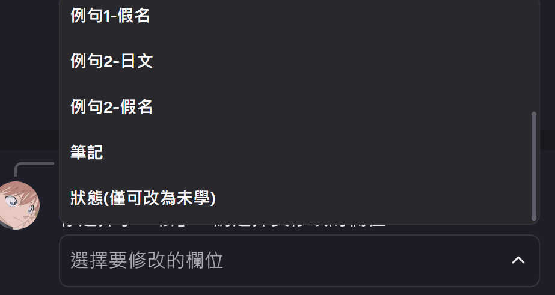

#  日文小助手 Discord Bot

這是一個可協助日語學習的 Discord 機器人，提供單字查詢、個人化學習本與隨機測驗等功能。

---

## 📌 功能特色

### 🔍 單字查詢 (`!lookup <日文字>`)


整合三種資料來源，提供全面的單字解釋：

- **Jisho API**：快速查找假名、詞性、英文解釋等資訊。
- **Goo 辭書爬蟲**：抓取日本在地辭書內容。
- **GroqAI**：透過 AI 提供額外說明與例句。

### 📝 學習本功能 (`!notebook`)

每位用戶都有專屬筆記本，支援以下操作：

- `add`：新增單字。
- `delete`：刪除單字。
- `edit`：編輯已儲存單字。
- `show`：列出目前筆記內容。

透過 Discord 的互動式按鈕操作，簡單易用。

### 🎯 測驗功能 (`!quiz`)

從使用者的學習本隨機出題：

- 題型一：**中譯日**（輸入正確的日文）。
- 題型二：**日譯中**（輸入正確的中文意思）。

---

## 📌功能詳細介紹

### 🫧起始畫面
當 discord bot連接到頻道，會自動跳出功能說明訊息。

<div align="center">
    
</div>


### 🔍 單字查詢

輸入 `!lookup <日文字>` 後會進行查詢，查詢完畢後即會跳出詳細功能說明。

- 輸入 `!lookup <日文字>`  

<div align="center">
    
</div>

- 查詢中(需等待)


<div align="center">
    
</div>
 

- 查詢完畢，顯示小功能

<div align="center">
    
</div>

---

### 🔍 單字查詢 - Jisho API

透過Jisho API直接查詢，可獲得單字對應之英文翻譯。  
點擊 `Jisho查詢`按鈕獲得結果。

- 有對應結果

<div align="center">
    
</div>

- 無對應結果

<div align="center">
    
</div>

---

### 🔍 單字查詢 - Goo 辭書爬蟲
爬蟲Goo 辭書獲得日日字典查詢結果，最多會顯現3個查詢結果。  
點擊 `Goo 辭書` 按鈕獲得結果。

- 有對應結果

<div align="center">
    
</div>

- 無對應結果

<div align="center">
    
</div>

---
### 🔍 單字查詢 - GroqAI
以Groq AI協助產生中文解釋、例句等。  
點擊 `GroqAI回答` 獲得結果。

- prompt

```
請用繁體中文解釋日文單字「{word}」的意思，並提供兩個常見例句（包含中文翻譯）。
    格式：
    日文單字:{word}
    解釋：
    拼音:
    例句1️⃣：
        日文句子
        日文拼音
    中文翻譯1️⃣：
        中文句子
    例句2️⃣：
        日文句子
        日文拼音
    中文翻譯2️⃣：
        中文句子

    請注意拼音內容要是平假名或片假名
```

- 結果

<div align="center">
    
</div>

---
### 🔍 單字查詢 - 加入學習本
可將groq ai回應功能快速加入學習本。  
點擊 `加入學習本`按鈕實現。

- 將groq ai結果轉為 學習本格式之 prompt:

```
請分析{s}之文字內容，並
    請嚴格回傳以下格式的 JSON 字串，並填入對應的內容：

    {{
    "japanese" :日文單字
    "chinese": "中文解釋",
    "reading": "假名拼音",
    "examples": [
        {{
        "jp_sentence": "日文句子1",
        "jp_reading": "拼音1",
        "chinese_translation": "中文翻譯1"
        }},
        {{
        "jp_sentence": "日文句子2",
        "jp_reading": "拼音2",
        "chinese_translation": "中文翻譯2"
        }}
    ]
    }}

    不要多餘的文字，只回傳純 JSON。
```

---

### 📝 學習本功能

輸入 `！notebook` 會叫出學習本功能的詳細介紹。  
每個用戶學習本為獨立儲存，以ID作為檔名。

- 功能詳細介紹

<div align="center">
    
</div>

- 學習本格式(json檔)

```
{
    "japanese": "",                     # 日文單字
    "chinese": "",                      # 中文
    "reading": "",                      # 拼音(假名)
    "examples": [                       # 例句
      {
        "jp_sentence": "",              # 日文例句1
        "jp_reading": "",               # 日文拼音1
        "chinese_translation": ""       # 中文翻譯1
      },
      {
        "jp_sentence": "",              # 日文例句2
        "jp_reading": "",               # 日文拼音2
        "chinese_translation": ""       # 中文翻譯2
      }
    ],
    "status": "",                       # 學習狀態(設定中譯日跟日譯中各對一次設為已學)
    "notes": "",                        # 自由筆記區
    "quiz_results": {                   # 紀錄測驗結果
      "jp_to_ch": {
        "correct": ,
        "wrong": 
      },
      "ch_to_jp": {
        "correct": ,
        "wrong": 
      }
    }
  }

```

---

### 📝 學習本功能 - 新增單字

可自行增加想要的單字，由於Modal欄位限制，新增時僅可輸入`日文、中文、假名、例句1(日文)、筆記`，前三項為必輸入欄位。  
點擊 `Add` 按鈕，輸入並提交後即會加入學習本。

- Modal頁面
<div align="center">
    
</div>

---

### 📝 學習本功能 - 刪除單字

可自行刪除學習本中的單字。  
點擊 `Delete` 按鈕， 輸入日文單字即回刪除。

- Modal頁面

<div align="center">
    
</div>

---

### 📝 學習本功能 - 顯示學習本內容

可看個人學習本內容，限制一頁顯示三個字。 可透過上/下一頁切換頁面。
點擊 `Show` 按鈕即會顯示。

- 顯示範例

<div align="center">
    
</div>

---

### 📝 學習本功能 - 編輯學習本

可選擇特定單字及欄位進行修改。  
點擊 `Edit` 按鈕，選擇單字(因選擇欄位上限僅有25個，故可透過上/下一頁選擇更多)。  
接著選擇修改欄位，並輸入即可。

- 選擇單字

<div align="center">
    
</div>

- 選擇欄位

<div align="center">
    
</div>

<div align="center">
    
</div>

- 編輯內容

<div align="center">
    
</div>

---
### 🎯 測驗功能
輸入 `!quiz` 會跳出詳細功能說明，有中譯日和日譯中兩種模式。  
且會更新已/未學狀態

- 功能詳細介紹

<div align="center">
    
</div>

- 狀態更新初步設定為兩項模式皆通過一次即為已學。
```
def update_quiz_result(word_data, direction, correct):
    """
    word_data: 詞彙 dict
    direction: 'jp_to_ch' 或 'ch_to_jp'
    correct: True or False
    """
    if "quiz_results" not in word_data:
        word_data["quiz_results"] = {"jp_to_ch": {"correct":0, "wrong":0}, "ch_to_jp": {"correct":0, "wrong":0}}

    if correct:
        word_data["quiz_results"][direction]["correct"] += 1
    else:
        word_data["quiz_results"][direction]["wrong"] += 1

    # 簡單判斷學習狀態
    corrects = word_data["quiz_results"]["jp_to_ch"]["correct"] and word_data["quiz_results"]["ch_to_jp"]["correct"]
    if corrects:
        word_data["status"] = "已學"
    else:
        word_data["status"] = "未學"
```


---
### 🎯 測驗功能 - 日譯中

點擊 `日譯中` 按鈕後可選擇題數，上限為25題或自己學習本內之單字上限。  
隨機出題(未學優先)，接著可選擇題目並回答。  
對錯將以groq ai協助判定。

- 輸入題數

<div align="center">
    
</div>

- 選擇題目

<div align="center">
    
</div>

- 回答

<div align="center">
    
</div>

---
### 🎯 測驗功能 - 中譯日

點擊 `日譯中` 按鈕後可選擇題數，上限為25題或自己學習本內之單字上限。  
隨機出題(未學優先)，接著可選擇題目並回答。  
需日文完全一樣才判對

- 輸入題數

<div align="center">
    
</div>

- 選擇題目

<div align="center">
    
</div>

- 回答

<div align="center">
    
</div>

---


